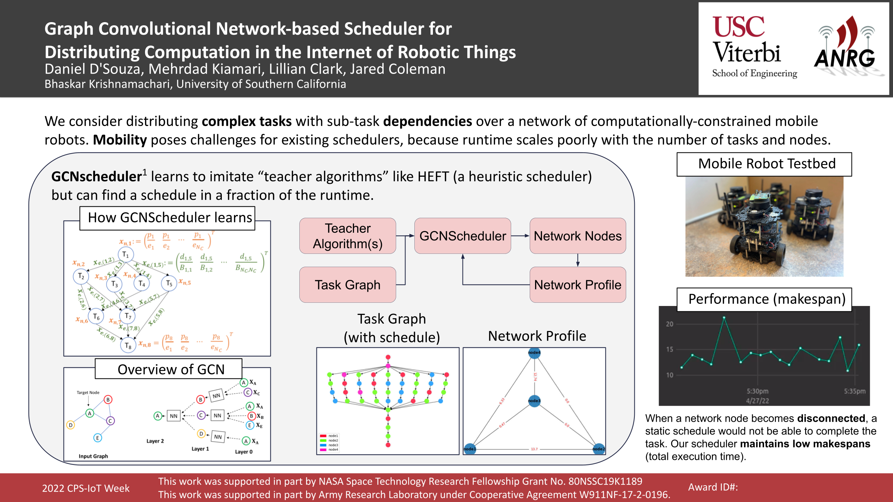

# GCNSchedule TurtleNet

[](https://gitpod.io/https://github.com/ANRGUSC/gcnschedule-turtlenet)

Graph Convolutional Network-based Scheduler for Distributing Computation in the Internet of Robotic Things



To learn more, check out


>Kiamari, Mehrdad, and Bhaskar Krishnamachari. "GCNScheduler: Scheduling Distributed Computing Applications using Graph Convolutional Networks." arXiv preprint arXiv:2110.11552 (2021).

## Code description

`src/gcnsched_demo` is a ROS2 package which contains launch files for each machine (e.g. `node1_launch.py`). Each robot runs an **Executor** ROS2 node (`gcnsched_demo/executor_node.py`) for performing subtasks and handling task-specific communication and a **Ping** ROS2 node (`gcnsched_demo/ping_node.py`) for building the network profile. A laptop runs the **Scheduler** ROS2 node (`gcnsched_demo/scheduler.py`) for executing GCNScheduler and a **Visualizer** ROS2 node (`gcnsched_demo/visualizer.py`) for constructing display outputs.

`edGNN` contains source code for solving inference problems on directed graphs. This submodule contains the GCNScheduler and `gcnsched/saved_model` which was trained to imitate the Heterogeneous Earliest Finish Time (HEFT) algrithm and is used to create schedules.

> Jaume, Guillaume, et al. "edGNN: a Simple and Powerful GNN for Directed Labeled Graphs." arXiv preprint arXiv:1904.08745 (2019).

`wfcommons` is a community framework for generating realistic task-graphs.

> T. Coleman, H. Casanova, L. Pottier, M. Kaushik, E. Deelman, and R. Ferreira da Silva, "WfCommons: A Framework for Enabling Scientific Workflow Research and Development," Future Generation Computer Systems, vol. 128, pp. 16-27, 2022. DOI: 10.1016/j.future.2021.09.043

`ROSboard` is a package for serving visualization from any machine to view via your browser.

>https://github.com/dheera/rosboard

## Using Docker
First build the docker images (if you opened in Gitpod, this has already been done - skip this step):
```bash
docker build -t smile_ros -f ros.Dockerfile .
docker build -t rosboard -f rosboard.Dockerfile .
```

Then pull and run Dozzle, a Docker image that's helpful for viewing logs (if you opened in Gitpod, this is already running - skip this step):
```bash
docker pull amir20/dozzle:latest
docker run --name dozzle -d --volume=/var/run/docker.sock:/var/run/docker.sock -p 8888:8080 amir20/dozzle:latest
```

#### To test the system with 4 network nodes (in containers):

```bash
docker-compose up -d
```

## Without using Docker

Follow the **Dashing** guide for setting up your Turtlebots and PC.

https://emanual.robotis.com/docs/en/platform/turtlebot3/quick-start/

Install requirements on each machine:

```
apt update && apt install -y python3-colcon-common-extensions libjpeg-dev zlib1g-dev python3-pip ffmpeg libsm6 libxext6 ros-dashing-cv-bridge
```

```
pip3 install matplotlib networkx torch
pip3 install git+https://github.com/ANRGUSC/edGNN.git@feature/gcnsched
pip3 install --upgrade pip && pip3 install opencv-python
pip3 install wfcommons
```

```
apt-get install -y python3-dev graphviz libgraphviz-dev pkg-config
pip3 install graphviz pygraphviz
```

#### To test the system with 4 network nodes (running locally):

From your colcon workspace

``colcon build --packages-select interfaces gcnsched_demo rosboard``

``tmuxp load <gcnsched_demo package dir>/tmuxp_config/test_schedule.yaml``
